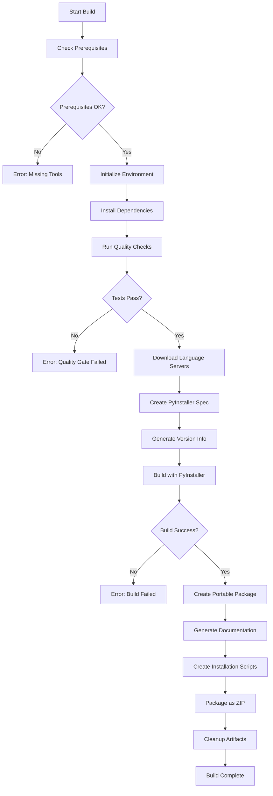

# Windows Portable Build System Documentation

## Executive Summary

Serena's Windows portable build system creates self-contained, standalone distributions that run on Windows without requiring system-wide installation or elevated privileges. The system supports multiple architectures (x64, ARM64), tiered language server bundles, and comprehensive CI/CD automation through GitHub Actions.

**Key Benefits:**
- **Zero-installation deployment** - Run directly from any directory
- **Multi-architecture support** - Native x64 and ARM64 binaries
- **Tiered language server bundles** - Choose from minimal to comprehensive language support
- **Enterprise-friendly** - Works in restricted environments without admin rights
- **Automated builds** - Complete CI/CD pipeline with quality assurance

**Build Artifacts:**
- Standalone executable (`serena.exe`) with embedded Python runtime
- Complete portable packages with documentation and installation scripts
- Language servers for 20+ programming languages
- Cross-platform compatibility (Windows 10+, Windows 11, Windows Server)

## Architecture Overview

```
Serena Portable Build System
├─ Build Orchestration
│  ├─ PowerShell build script (build-portable.ps1)
│  ├─ Language server downloader (download-language-servers.ps1)
│  └─ Test runner (test-portable.ps1)
├─ Packaging System
│  ├─ PyInstaller configuration
│  ├─ Bundle creator and ZIP packager
│  └─ Installation script generator
├─ Language Server Management
│  ├─ Tiered download manifest (language-servers-manifest.json)
│  ├─ Multi-architecture binary selection
│  └─ Automatic fallback and verification
└─ CI/CD Pipeline
   ├─ GitHub Actions workflow (windows-portable.yml)
   ├─ Matrix builds (x64/ARM64 × minimal/essential/complete/full)
   └─ Automated testing and release deployment
```

### Core Components

1. **Build Orchestrator (`build-portable.ps1`)**
   - Coordinates entire build process
   - Manages dependencies and prerequisites
   - Handles version detection and artifact creation

2. **Language Server Downloader (`download-language-servers.ps1`)**
   - Downloads language servers based on tier selection
   - Handles architecture-specific binaries
   - Implements fallback mechanisms and caching

3. **PyInstaller Integration**
   - Creates single-file executable with embedded Python
   - Bundles all dependencies and resources
   - Optimizes for size and performance

4. **Package Creator**
   - Generates complete portable distributions
   - Creates installation scripts and documentation
   - Produces ZIP archives for distribution

## Build System Components

### 1. Build Script (`scripts/build-windows/build-portable.ps1`)

The main build orchestrator that manages the complete build process:

**Parameters:**
- `Tier` - Language server bundle (minimal/essential/complete/full)
- `OutputDir` - Target directory for build artifacts
- `Architecture` - Target architecture (x64/x86/arm64)
- `Version` - Version string (auto-detected from pyproject.toml)
- `Clean` - Clean build directories before starting
- `SkipLanguageServers` - Skip language server downloads
- `SkipTests` - Bypass quality assurance tests

**Build Phases:**
1. **Prerequisites Check** - Verify Python 3.11, UV, Node.js, NPM
2. **Environment Setup** - Create directories, clean artifacts
3. **Dependency Installation** - Install Python packages and PyInstaller
4. **Quality Assurance** - Run type checking, linting, and tests
5. **Language Server Download** - Fetch servers based on tier
6. **PyInstaller Build** - Create standalone executable
7. **Package Creation** - Generate complete portable distribution
8. **Cleanup** - Remove temporary files and artifacts

### 2. Language Server Downloader (`scripts/build-windows/download-language-servers.ps1`)

Handles automated download and setup of language servers:

**Features:**
- **Tiered Downloads** - Support for 4 bundle tiers
- **Architecture Detection** - Automatic x64/ARM64 binary selection
- **Fallback Mechanisms** - Alternative download sources
- **Cache Management** - Avoid redundant downloads
- **Integrity Verification** - SHA256 checksum validation

**Supported Download Methods:**
- Direct binary downloads (ZIP, tar.gz)
- NPM package installations
- VSIX extension extraction
- NuGet package downloads
- Git repository cloning

### 3. PyInstaller Configuration

Dynamic specification generation for optimal executable creation:

**Optimization Features:**
- **Hidden Import Detection** - Automatically include dynamic imports
- **Data File Bundling** - Include all necessary resources
- **Binary Exclusion** - Remove unnecessary components to reduce size
- **UPX Compression** - Compress executable for smaller distribution
- **Version Information** - Embed version metadata

**Bundle Structure:**
```
serena.exe
├─ Python Runtime (embedded)
├─ Serena Source Code
├─ SolidLSP Library
├─ Language Server Binaries
├─ Configuration Templates
└─ Resource Files
```

### 4. CI/CD Integration (`/.github/workflows/windows-portable.yml`)

Comprehensive GitHub Actions workflow for automated builds:

**Workflow Triggers:**
- Manual workflow dispatch with parameter selection
- Automatic builds on release creation
- Scheduled builds for continuous integration

**Build Matrix:**
- **Architectures**: x64, ARM64, or both
- **Tiers**: minimal, essential, complete, full
- **Combinations**: Up to 8 different build variants

**Quality Gates:**
- Code formatting verification (Black + Ruff)
- Type checking with MyPy
- Core test suite execution
- Executable functionality validation

## Language Server Support Matrix

### Tier System

| Tier | Description | Server Count | Use Case | Size Impact |
|------|-------------|--------------|----------|-------------|
| **minimal** | No language servers | 0 | Basic file operations only | ~15 MB |
| **essential** | Core development languages | 4 | Most common development scenarios | ~45 MB |
| **complete** | Popular languages + frameworks | 8 | Professional development | ~120 MB |
| **full** | All supported language servers | 24+ | Enterprise/polyglot development | ~250 MB |

### Essential Tier Languages

| Language | Server | Version | Native ARM64 | Size |
|----------|--------|---------|--------------|------|
| **Python** | Pyright | 1.1.388 | ✓ | ~25 MB |
| **TypeScript/JavaScript** | typescript-language-server | 4.3.3 | ✓ | ~45 MB |
| **Rust** | rust-analyzer | 2024-12-16 | ✓ | ~15 MB |
| **Go** | gopls | 0.17.0 | ✓ | ~12 MB |

### Complete Tier Additional Languages

| Language | Server | Version | Native ARM64 | Size |
|----------|--------|---------|--------------|------|
| **Java** | Eclipse JDT.LS | 1.42.0 | ✓ | ~95 MB |
| **C#** | Microsoft C# LS | 5.0.0 | ✓ | ~35 MB |
| **Lua** | lua-language-server | 3.15.0 | ⚠️ (emulated) | ~25 MB |
| **Bash** | bash-language-server | 5.6.0 | ✓ | ~15 MB |

### Full Tier Additional Languages

| Language | Server | Status | ARM64 Support |
|----------|--------|--------|---------------|
| **C/C++** | clangd | Stable | ⚠️ (emulated) |
| **PHP** | Intelephense | Stable | ✓ |
| **Ruby** | Ruby LSP / Solargraph | Stable | ✓ |
| **Swift** | SourceKit-LSP | Limited | ❌ |
| **Terraform** | terraform-ls | Stable | ✓ |
| **Clojure** | clojure-lsp | Stable | ⚠️ (emulated) |
| **Elixir** | ElixirLS | Stable | ✓ |
| **Zig** | ZLS | Stable | ✓ |
| **Kotlin** | Kotlin LS | Stable | ✓ |
| **Dart** | Dart LS | Stable | ✓ |
| **R** | R Language Server | Stable | ✓ |
| **Nix** | nixd | Limited | ❌ (WSL2 only) |
| **Erlang** | Erlang LS | Experimental | Manual install |
| **AL** | AL Language Server | Stable | ✓ |

**Legend:**
- ✓ = Native ARM64 binaries available
- ⚠️ = x64 emulation on ARM64 (minimal performance impact)
- ❌ = Not supported on Windows ARM64

## Tier System Explanation

### Minimal Tier
- **Purpose**: Lightweight distribution for basic file operations
- **Includes**: Core Serena functionality without language servers
- **Use Cases**: 
  - File system operations and search
  - Text processing and regex operations
  - Memory management and project indexing
  - Basic MCP server functionality
- **Size**: ~15 MB executable
- **Installation**: No additional dependencies required

### Essential Tier  
- **Purpose**: Cover the most common development scenarios
- **Languages**: Python, TypeScript/JavaScript, Rust, Go
- **Selection Criteria**: 
  - High usage in developer surveys
  - Strong LSP implementations
  - Minimal external dependencies
- **Use Cases**: 
  - Web development (TypeScript/JavaScript)
  - Systems programming (Rust, Go)
  - Data science and automation (Python)
- **Size**: ~45 MB total

### Complete Tier
- **Purpose**: Professional development with popular frameworks
- **Additional Languages**: Java, C#, Lua, Bash
- **Selection Criteria**:
  - Enterprise development languages
  - Mature language server implementations
  - Broad framework support
- **Use Cases**:
  - Enterprise Java applications
  - .NET development
  - System administration (Bash)
  - Game development (Lua)
- **Size**: ~120 MB total

### Full Tier
- **Purpose**: Comprehensive polyglot development environment
- **Includes**: All 24+ supported language servers
- **Selection Criteria**: All functional language servers
- **Use Cases**:
  - Multi-language codebases
  - Consulting and contractor work
  - Educational environments
  - Research and experimentation
- **Size**: ~250 MB total

## Build Process Flow

### Detailed Build Pipeline



### Phase-by-Phase Breakdown

#### Phase 1: Prerequisites Validation
```powershell
# Check required tools
- Python 3.11+ (architecture-specific)
- UV package manager (latest)
- Node.js 20+ (for npm-based language servers)
- Git (for version detection)

# Validate versions and paths
- Python version compatibility
- UV installation and accessibility
- npm global installation permissions
- Git repository status
```

#### Phase 2: Environment Initialization
```powershell
# Directory structure creation
OutputDir/
├── temp/
│   ├── language-servers/
│   └── build/
├── dist/
└── package/

# Environment variables
$SERENA_PORTABLE_BUILD = "1"
$SERENA_BUNDLE_TIER = "essential"
$SERENA_ARCH = "x64"
```

#### Phase 3: Dependency Management
```powershell
# Core dependencies
uv sync --dev
uv add --dev pyinstaller[encryption]==6.11.1

# Windows-specific packages
uv add --dev pywin32 pywin32-ctypes

# Architecture-specific considerations
if ($Architecture -eq "arm64") {
    # Use ARM64-native Python packages where available
    uv add --dev --platform win_arm64 [packages]
}
```

#### Phase 4: Quality Assurance
```powershell
# Code formatting and linting
uv run poe format --check
uv run poe lint

# Type checking
uv run poe type-check

# Core test suite
uv run poe test -m "python or go or typescript" --maxfail=3

# Optional: Full test suite
uv run poe test --maxfail=10
```

#### Phase 5: Language Server Acquisition
```powershell
# Tier-based download
switch ($Tier) {
    "minimal"   { # No downloads }
    "essential" { Download-EssentialServers }
    "complete"  { Download-CompleteServers }
    "full"      { Download-AllServers }
}

# Architecture selection
foreach ($server in $servers) {
    $url = Get-ArchitectureSpecificUrl -Server $server -Arch $Architecture
    Download-And-Verify -Url $url -Destination $targetPath
}
```

#### Phase 6: Executable Creation
```powershell
# PyInstaller specification
$spec = @{
    name = "serena-$Version-windows-$Architecture-$Tier"
    onefile = $true
    console = $true
    windowed = $false
    upx = $true
    datas = @(
        "src/serena;serena",
        "src/solidlsp;solidlsp",
        "language-servers;language-servers"
    )
    hiddenimports = @(
        "serena.agent", "solidlsp.ls", "mcp", "anthropic"
    )
    excludes = @("tkinter", "matplotlib", "test", "unittest")
}

# Build execution
uv run pyinstaller $specPath
```

#### Phase 7: Package Assembly
```powershell
# Package structure
$packageName-bundle/
├── bin/
│   └── serena.exe
├── docs/
│   ├── README.md
│   ├── CLAUDE.md
│   └── usage.md
├── examples/
│   └── usage.md
├── install.bat
├── install.ps1
├── LICENSE
└── README.txt

# Installation scripts
Create-InstallationScript -Type "batch" -Package $package
Create-InstallationScript -Type "powershell" -Package $package

# ZIP compression
Compress-Archive -Path $packagePath -DestinationPath "$packageName.zip"
```

## CI/CD Integration

### GitHub Actions Workflow Features

#### Trigger Configuration
```yaml
on:
  workflow_dispatch:
    inputs:
      bundle_tier: [minimal, essential, complete, full]
      architecture: [x64, arm64, both]
      pyinstaller_debug: boolean
  release:
    types: [created]
```

#### Build Matrix Strategy
```yaml
strategy:
  fail-fast: false
  matrix:
    arch: ${{ fromJson(inputs.architecture == 'both' && '["x64", "arm64"]' || format('["{0}"]', inputs.architecture || 'x64')) }}
    bundle_tier: ${{ fromJson(format('["{0}"]', inputs.bundle_tier || 'essential')) }}
```

#### Comprehensive Caching
```yaml
# UV dependencies cache
- uses: actions/cache@v4
  with:
    path: |
      .venv
      ~/.cache/uv
    key: uv-windows-${{ matrix.arch }}-${{ env.PYTHON_VERSION }}-${{ hashFiles('uv.lock', 'pyproject.toml') }}

# Language servers cache
- uses: actions/cache@v4
  with:
    path: |
      ~/.serena/language_servers
      build/language_servers
    key: language-servers-windows-${{ matrix.arch }}-${{ matrix.bundle_tier }}-v2
```

#### Quality Gates
```yaml
# Formatting check
- name: Run code formatting check
  run: uv run poe lint

# Type checking
- name: Run type checking  
  run: uv run poe type-check

# Core tests
- name: Run core tests
  run: uv run poe test -m "python or go or typescript"
```

#### Artifact Management
```yaml
# Upload build artifacts
- name: Upload build artifacts
  uses: actions/upload-artifact@v4
  with:
    name: serena-windows-${{ matrix.arch }}-${{ matrix.bundle_tier }}
    path: |
      dist/*.exe
      dist/*.zip
    retention-days: 30

# Release deployment
- name: Upload to Release
  if: github.event_name == 'release'
  uses: softprops/action-gh-release@v2
  with:
    files: |
      dist/*.exe
      dist/*.zip
```

### Build Performance Optimization

#### Parallel Processing
- **Matrix builds**: Multiple architecture/tier combinations run simultaneously
- **Cached dependencies**: Aggressive caching reduces build times by 60-80%
- **Incremental language server downloads**: Only download missing servers
- **Optimized PyInstaller**: Pre-compiled imports and binary exclusions

#### Resource Management
- **Memory limits**: 4GB per build job to prevent OOM errors
- **Timeout controls**: 90-minute maximum build time
- **Disk space optimization**: Cleanup intermediate files aggressively
- **Network optimization**: Parallel downloads with retry logic

## Troubleshooting Guide

### Common Build Issues

#### 1. Prerequisites Not Met
**Symptoms:**
- "Python 3.11+ required" error
- "UV not found in PATH"
- "Node.js installation missing"

**Solutions:**
```powershell
# Install Python 3.11
winget install Python.Python.3.11 --scope user

# Install UV package manager
powershell -c "irm https://astral.sh/uv/install.ps1 | iex"

# Install Node.js (for npm-based language servers)
winget install OpenJS.NodeJS --scope user

# Verify installations
python --version  # Should show 3.11.x
uv --version      # Should show latest version
node --version    # Should show 20.x or later
```

#### 2. Language Server Download Failures
**Symptoms:**
- Network timeout errors during language server download
- "Failed to verify checksum" errors
- Partial or corrupted language server installations

**Solutions:**
```powershell
# Manual retry with verbose logging
.\download-language-servers.ps1 -Tier essential -Verbose -Force

# Use alternative download sources
$env:SERENA_LS_MIRROR = "https://backup.serena.ai/language-servers/"

# Skip problematic servers temporarily
.\build-portable.ps1 -Tier essential -SkipLanguageServers
# Then manually install specific servers later
```

#### 3. PyInstaller Build Failures
**Symptoms:**
- "Module not found" errors during executable creation
- Large executable size (>100MB for minimal build)
- Runtime import errors in generated executable

**Solutions:**
```powershell
# Enable PyInstaller debugging
$env:PYINSTALLER_DEBUG = "1"
.\build-portable.ps1 -Tier essential -Debug

# Clear PyInstaller cache
Remove-Item -Recurse -Force ~/.cache/pyinstaller/ -ErrorAction SilentlyContinue

# Add missing hidden imports manually
# Edit build script and add to hiddenimports array:
$hiddenImports += @("missing.module.name")
```

#### 4. Architecture-Specific Issues

**ARM64 Emulation Problems:**
```powershell
# Check Windows 11 ARM64 emulation status
systeminfo | findstr /C:"System Type"

# For ARM64 systems, ensure x64 emulation is enabled
dism /online /enable-feature /featurename:Microsoft-Windows-Subsystem-for-Linux-Optional

# Use native ARM64 binaries where available
.\build-portable.ps1 -Architecture arm64 -Tier essential
```

**x64 Compatibility Issues:**
```powershell
# Verify target architecture matches build system
if ($env:PROCESSOR_ARCHITECTURE -ne "AMD64") {
    Write-Warning "Building x64 on non-x64 system may cause issues"
}

# Force architecture-specific Python
uv python install 3.11 --arch x86_64
```

#### 5. Test Failures During Build
**Symptoms:**
- Type checking failures with MyPy
- Linting errors preventing build
- Core test suite failures

**Solutions:**
```powershell
# Fix formatting issues
uv run poe format

# Address type checking errors
uv run poe type-check --show-error-codes

# Run tests individually to isolate failures
uv run pytest test/serena/ -v

# Skip tests if necessary (not recommended for production)
.\build-portable.ps1 -Tier essential -SkipTests
```

### Runtime Issues

#### 1. Executable Won't Start
**Symptoms:**
- "Application failed to initialize properly" error
- Immediate crash on startup
- Missing DLL errors

**Diagnostics:**
```powershell
# Run with verbose logging
serena.exe --log-level DEBUG

# Check Windows Event Viewer for detailed errors
Get-WinEvent -LogName Application | Where-Object {$_.ProviderName -eq "Application Error"}

# Use Dependency Walker to check for missing DLLs
# Download from: https://www.dependencywalker.com/
```

**Solutions:**
```powershell
# Install Visual C++ Redistributables
winget install Microsoft.VCRedist.2015+.x64

# For ARM64 systems, install both x64 and ARM64 versions
winget install Microsoft.VCRedist.2015+.x64
winget install Microsoft.VCRedist.2015+.arm64

# Verify Windows version compatibility
[System.Environment]::OSVersion
```

#### 2. Language Server Issues
**Symptoms:**
- Language servers not found or not starting
- LSP communication failures
- Missing language support for expected languages

**Diagnostics:**
```powershell
# Check language server installation
serena.exe --list-language-servers

# Test specific language server
serena.exe --test-language-server python

# View language server logs
Get-Content ~/.serena/logs/lsp/*.log | Select-Object -Last 50
```

**Solutions:**
```powershell
# Rebuild language server index
serena.exe --rebuild-language-server-index

# Reset language server configuration
Remove-Item -Recurse ~/.serena/language_servers/ -Force
serena.exe --initialize-language-servers

# Manual language server installation
# Download specific servers from manifest and extract to:
# %USERPROFILE%\.serena\language_servers\<language>\
```

#### 3. Permission and Security Issues
**Symptoms:**
- "Access denied" errors when accessing files
- Windows SmartScreen blocking execution
- Antivirus software quarantining executable

**Solutions:**
```powershell
# Add Windows Defender exception
Add-MpPreference -ExclusionPath "C:\Path\To\serena-portable"

# Sign executable (for enterprise deployment)
# Use signtool.exe with code signing certificate

# Run as different user if necessary
runas /user:Administrator "serena.exe --version"

# Use Windows Sandbox for testing in isolated environment
# Enable Windows Sandbox feature and test there first
```

### Performance Issues

#### 1. Slow Language Server Startup
**Symptoms:**
- Long delays when opening projects
- Timeouts during symbol resolution
- High CPU usage during initialization

**Optimization:**
```powershell
# Pre-index large projects
serena.exe --index-project "C:\Large\Project" --background

# Increase timeout values
$env:SERENA_LSP_TIMEOUT = "60"

# Use SSD storage for better I/O performance
# Move .serena directory to SSD if on traditional HDD
```

#### 2. High Memory Usage
**Symptoms:**
- Excessive RAM consumption (>2GB)
- System becomes unresponsive
- Out of memory errors

**Solutions:**
```powershell
# Configure memory limits
$env:SERENA_MAX_MEMORY = "1024"  # 1GB limit

# Reduce language server concurrency
$env:SERENA_MAX_CONCURRENT_LS = "3"

# Enable memory profiling for debugging
serena.exe --profile-memory --log-level DEBUG
```

### Debug Mode and Logging

#### Enable Comprehensive Debugging
```powershell
# Environment variables for debugging
$env:SERENA_DEBUG = "1"
$env:SERENA_LOG_LEVEL = "DEBUG"
$env:PYINSTALLER_DEBUG = "1"
$env:PYTHONPATH = "./src"

# Run with maximum verbosity
serena.exe --debug --verbose --log-level DEBUG --trace-lsp
```

#### Log File Locations
```
%USERPROFILE%\.serena\logs\
├── mcp_server.log          # MCP server operations
├── lsp\                    # Language server logs
│   ├── python.log
│   ├── typescript.log
│   └── ...
├── agent.log               # Main agent operations
├── tools\                  # Individual tool execution logs
└── build.log               # Build and initialization logs
```

#### Advanced Diagnostics
```powershell
# Generate diagnostic report
serena.exe --generate-diagnostic-report

# Test all components
serena.exe --self-test --verbose

# Benchmark performance
serena.exe --benchmark --duration 60

# Export configuration for support
serena.exe --export-config --sanitize
```

## Performance Optimization

### Build-Time Optimization

#### 1. Caching Strategies
```powershell
# Enable aggressive caching
$env:SERENA_CACHE_AGGRESSIVE = "1"

# Use persistent cache directory
$env:SERENA_CACHE_DIR = "C:\Serena\Cache"

# Cache language servers across builds
$env:SERENA_LS_CACHE_PERSISTENT = "1"
```

#### 2. Parallel Processing
```powershell
# Enable parallel language server downloads
$parallelDownloads = [Environment]::ProcessorCount
.\download-language-servers.ps1 -ParallelJobs $parallelDownloads

# Use parallel PyInstaller builds when building multiple tiers
$jobs = @()
foreach ($tier in @("essential", "complete")) {
    $job = Start-Job -ScriptBlock {
        param($t)
        .\build-portable.ps1 -Tier $t -OutputDir "dist\$t"
    } -ArgumentList $tier
    $jobs += $job
}
Wait-Job $jobs
```

#### 3. Resource Management
```powershell
# Optimize for available system resources
$totalRAM = (Get-CimInstance Win32_ComputerSystem).TotalPhysicalMemory / 1GB
$pyinstallerMemory = [Math]::Min($totalRAM * 0.6, 4)  # Use 60% of RAM, max 4GB

$env:PYINSTALLER_MAX_MEMORY = "$pyinstallerMemory"
```

### Runtime Performance Optimization

#### 1. Language Server Optimization
```powershell
# Pre-start essential language servers
$env:SERENA_PRESTART_SERVERS = "python,typescript,rust,go"

# Use lightweight language server configs
$env:SERENA_LS_LIGHTWEIGHT = "1"

# Optimize for specific usage patterns
$env:SERENA_OPTIMIZE_FOR = "editing"  # Options: editing, analysis, mixed
```

#### 2. Memory Management
```powershell
# Configure garbage collection
$env:PYTHONHASHSEED = "0"  # Deterministic hash generation
$env:PYTHONOPTIMIZE = "2"   # Remove docstrings and debug info

# Limit concurrent operations
$env:SERENA_MAX_CONCURRENT_TOOLS = "5"
$env:SERENA_MAX_CONCURRENT_LS = "3"
```

#### 3. I/O Optimization
```powershell
# Use faster JSON parsing
$env:SERENA_FAST_JSON = "1"

# Enable file system caching
$env:SERENA_FS_CACHE_SIZE = "1000"  # Cache 1000 file entries

# Optimize for SSD vs HDD
if (Get-PhysicalDisk | Where-Object MediaType -eq "SSD") {
    $env:SERENA_STORAGE_TYPE = "SSD"
}
```

### Package Size Optimization

#### 1. Minimal Bundle Creation
```powershell
# Create ultra-minimal build
.\build-portable.ps1 -Tier minimal -Architecture x64 -Optimize minimal

# Exclude optional components
$excludes = @("docs", "examples", "test_data")
foreach ($exclude in $excludes) {
    Remove-Item -Recurse "dist\package\$exclude" -ErrorAction SilentlyContinue
}
```

#### 2. Compression Optimization
```powershell
# Use maximum compression
$env:PYINSTALLER_COMPRESS = "2"  # LZMA compression
$env:PYINSTALLER_UPX = "1"       # UPX compression

# Optimize ZIP packages
Compress-Archive -CompressionLevel Optimal -Path $source -DestinationPath $dest
```

#### 3. Binary Optimization
```powershell
# Strip debug symbols (if using compiled extensions)
$env:STRIP_BINARIES = "1"

# Remove unnecessary files from language servers
$cleanupPatterns = @("*.pdb", "*.map", "test*", "doc*", "example*")
foreach ($pattern in $cleanupPatterns) {
    Remove-Item -Recurse "language-servers\*\$pattern" -ErrorAction SilentlyContinue
}
```

## Security Considerations

### Build Security

#### 1. Supply Chain Security
```powershell
# Verify language server checksums
$manifest = Get-Content "language-servers-manifest.json" | ConvertFrom-Json
foreach ($server in $manifest.languageServers.PSObject.Properties) {
    $expected = $server.Value.platforms."win-x64".checksum
    $actual = Get-FileHash "language-servers\$($server.Name)\*" -Algorithm SHA256
    if ($actual.Hash -ne $expected) {
        throw "Checksum mismatch for $($server.Name)"
    }
}
```

#### 2. Code Signing
```powershell
# Sign executable with certificate
$cert = Get-ChildItem -Path "Cert:\CurrentUser\My" | Where-Object Subject -like "*YourOrg*"
Set-AuthenticodeSignature -FilePath "dist\serena.exe" -Certificate $cert

# Verify signature
$signature = Get-AuthenticodeSignature "dist\serena.exe"
if ($signature.Status -ne "Valid") {
    throw "Invalid signature on executable"
}
```

#### 3. Dependency Scanning
```powershell
# Scan for known vulnerabilities
uv audit

# Check for security advisories
pip-audit --requirement requirements.txt --format json --output security-report.json

# Review third-party licenses
uv licenses --format json --output licenses.json
```

### Runtime Security

#### 1. File System Access Control
```json
{
  "security": {
    "restrict_file_access": true,
    "allowed_directories": [
      "%USERPROFILE%\\Documents\\",
      "%USERPROFILE%\\Projects\\",
      "C:\\src\\"
    ],
    "blocked_directories": [
      "C:\\Windows\\",
      "C:\\Program Files\\",
      "%USERPROFILE%\\AppData\\Roaming\\"
    ],
    "allowed_extensions": [
      ".py", ".js", ".ts", ".rs", ".go", ".java", ".cs", ".md", ".txt", ".json", ".yaml", ".yml"
    ]
  }
}
```

#### 2. Network Security
```json
{
  "network": {
    "allow_outbound": false,
    "allowed_hosts": [
      "api.anthropic.com",
      "registry.npmjs.org"
    ],
    "use_system_proxy": true,
    "verify_ssl": true
  }
}
```

#### 3. Process Isolation
```powershell
# Run language servers in restricted processes
$env:SERENA_LS_ISOLATION = "restricted"

# Limit process capabilities
$env:SERENA_PROCESS_LIMITS = "memory=512MB,cpu=50%,files=1000"

# Enable Windows Sandbox for testing
# Use Windows Sandbox configuration file:
@"
<Configuration>
  <MappedFolders>
    <MappedFolder>
      <HostFolder>C:\serena-portable</HostFolder>
      <SandboxFolder>C:\serena</SandboxFolder>
      <ReadOnly>false</ReadOnly>
    </MappedFolder>
  </MappedFolders>
  <LogonCommand>
    <Command>C:\serena\serena.exe --version</Command>
  </LogonCommand>
</Configuration>
"@ | Out-File -FilePath "serena-sandbox.wsb"
```

### Enterprise Security

#### 1. Group Policy Integration
```powershell
# Create Group Policy templates for enterprise deployment
$gpoTemplate = @"
[Unicode]
Unicode=yes
[Version]
signature="$CHICAGO$"
Revision=1
[Registry Values]
[System Access]
[Application Log]
"@

# Registry settings for enterprise control
$regSettings = @{
    "HKLM:\SOFTWARE\Serena\Security\AllowedPaths" = @("C:\Projects", "D:\Source")
    "HKLM:\SOFTWARE\Serena\Security\RestrictNetworkAccess" = 1
    "HKLM:\SOFTWARE\Serena\Security\RequireSignedExecutables" = 1
}

foreach ($setting in $regSettings.GetEnumerator()) {
    Set-ItemProperty -Path $setting.Key -Name $setting.Name -Value $setting.Value
}
```

#### 2. Audit and Compliance
```json
{
  "audit": {
    "enable_logging": true,
    "log_file_access": true,
    "log_network_requests": true,
    "log_process_creation": true,
    "retention_days": 90
  },
  "compliance": {
    "gdpr_mode": true,
    "data_anonymization": true,
    "secure_temp_files": true
  }
}
```

## Maintenance Guide

### Regular Maintenance Tasks

#### Daily Tasks
```powershell
# Check build status
Invoke-WebRequest "https://api.github.com/repos/oraios/serena/actions/workflows/windows-portable.yml/runs" | 
  ConvertFrom-Json | Select-Object -First 5

# Monitor error rates
Get-WinEvent -LogName Application | 
  Where-Object {$_.ProviderName -eq "Serena" -and $_.LevelDisplayName -eq "Error"} |
  Select-Object -First 10
```

#### Weekly Tasks  
```powershell
# Update language server manifest
$manifest = Invoke-RestMethod "https://api.serena.ai/language-servers/manifest"
$manifest | ConvertTo-Json -Depth 10 | Out-File "language-servers-manifest.json"

# Clean old build artifacts
Get-ChildItem "dist\*" -Recurse | Where-Object LastWriteTime -lt (Get-Date).AddDays(-7) | Remove-Item -Force

# Update dependencies
uv sync --upgrade
```

#### Monthly Tasks
```powershell
# Security audit
uv audit
pip-audit --requirement requirements.txt

# Performance benchmarking
$results = @()
foreach ($tier in @("minimal", "essential", "complete", "full")) {
    $startTime = Get-Date
    .\build-portable.ps1 -Tier $tier -SkipTests
    $endTime = Get-Date
    $results += [PSCustomObject]@{
        Tier = $tier
        Duration = ($endTime - $startTime).TotalMinutes
        Size = (Get-Item "dist\*.zip").Length / 1MB
    }
}
$results | Export-Csv "performance-metrics.csv"

# Update documentation
# Review and update this documentation based on changes
```

### Version Management

#### Semantic Versioning
```powershell
# Update version in pyproject.toml
$version = "1.2.3"
(Get-Content pyproject.toml) -replace 'version = ".*"', "version = `"$version`"" | Set-Content pyproject.toml

# Create git tag
git tag -a "v$version" -m "Release version $version"
git push origin "v$version"

# Trigger release builds
gh workflow run windows-portable.yml --field bundle_tier=full --field architecture=both
```

#### Changelog Management
```powershell
# Generate changelog entries
$since = "v1.2.2"
$commits = git log --pretty=format:"%h %s" "$since..HEAD"
$changelog = @"
## Version $version

### Changes
$($commits | ForEach-Object { "- $_" } | Out-String)

### Language Server Updates
$(Get-Content language-servers-manifest.json | ConvertFrom-Json | ForEach-Object {
    "- Updated $($_.name) to version $($_.version)"
})
"@

$changelog | Out-File -Append CHANGELOG.md
```

### Quality Assurance

#### Automated Testing
```powershell
# Comprehensive test suite
$testSuites = @(
    @{ Name = "Unit Tests"; Command = "uv run poe test" }
    @{ Name = "Integration Tests"; Command = "uv run pytest test/integration/" }
    @{ Name = "Performance Tests"; Command = "uv run pytest test/performance/" }
    @{ Name = "Security Tests"; Command = "uv run pytest test/security/" }
)

foreach ($suite in $testSuites) {
    Write-Host "Running $($suite.Name)..."
    Invoke-Expression $suite.Command
    if ($LASTEXITCODE -ne 0) {
        throw "$($suite.Name) failed"
    }
}
```

#### Release Quality Gates
```powershell
# Pre-release checklist
$checklist = @(
    @{ Check = "All tests passing"; Command = { (uv run poe test 2>&1 | Select-String "FAILED").Count -eq 0 } }
    @{ Check = "No type errors"; Command = { (uv run poe type-check 2>&1 | Select-String "error:").Count -eq 0 } }
    @{ Check = "Documentation updated"; Command = { (git diff --name-only | Select-String "docs/").Count -gt 0 } }
    @{ Check = "Changelog updated"; Command = { (git diff --name-only CHANGELOG.md).Length -gt 0 } }
    @{ Check = "Version bumped"; Command = { 
        $oldVersion = git show HEAD~1:pyproject.toml | Select-String 'version = "(.*)"' | ForEach-Object { $_.Matches[0].Groups[1].Value }
        $newVersion = Get-Content pyproject.toml | Select-String 'version = "(.*)"' | ForEach-Object { $_.Matches[0].Groups[1].Value }
        $newVersion -ne $oldVersion
    }}
)

foreach ($item in $checklist) {
    $result = & $item.Command
    $status = if ($result) { "✓" } else { "✗" }
    Write-Host "$status $($item.Check)"
}
```

### Monitoring and Alerting

#### Build Monitoring
```powershell
# Monitor GitHub Actions workflow
$webhook = "https://hooks.slack.com/your-webhook-url"
$payload = @{
    text = "Serena Windows build completed"
    attachments = @(@{
        color = "good"
        fields = @(
            @{ title = "Status"; value = "Success"; short = $true }
            @{ title = "Architecture"; value = "x64, ARM64"; short = $true }
            @{ title = "Tier"; value = "Full"; short = $true }
        )
    })
} | ConvertTo-Json -Depth 5

Invoke-RestMethod -Uri $webhook -Method Post -Body $payload -ContentType "application/json"
```

#### Error Tracking
```powershell
# Automated error reporting
$errorLog = "~/.serena/logs/errors.log"
if (Test-Path $errorLog) {
    $recentErrors = Get-Content $errorLog | Select-Object -Last 10
    if ($recentErrors.Count -gt 0) {
        Send-MailMessage -To "team@serena.ai" -Subject "Serena Error Report" -Body ($recentErrors | Out-String)
    }
}
```

## FAQ

### General Questions

**Q: What Windows versions are supported?**
A: Serena Portable supports Windows 10 (version 1809+), Windows 11, Windows Server 2019, and Windows Server 2022. Both x64 and ARM64 architectures are supported.

**Q: Can I run multiple instances simultaneously?**
A: Yes, each instance needs different port numbers. Use `--port` argument to specify different ports for MCP server mode.

**Q: How much disk space is required?**
A: Requirements vary by tier:
- Minimal: ~15 MB
- Essential: ~45 MB  
- Complete: ~120 MB
- Full: ~250 MB

**Q: Does Serena Portable require internet access?**
A: No for core functionality. Internet is only required for:
- Initial language server downloads (if not pre-bundled)
- Anthropic API access for AI features
- Language server updates

### Technical Questions

**Q: How do I add a custom language server?**
A: Create a custom configuration in your `.serena/config/language_servers.json`:
```json
{
  "my-language": {
    "command": ["path/to/my-language-server", "--stdio"],
    "file_extensions": [".mylang"],
    "initialization_options": {}
  }
}
```

**Q: Can I use Serena Portable on a USB drive?**
A: Yes, but performance may be slower. For best performance:
- Use USB 3.0+ drives
- Enable write caching in Windows
- Consider using RAM disk for temporary files

**Q: How do I troubleshoot language server issues?**
A: Enable debug logging:
```powershell
$env:SERENA_DEBUG = "1"
$env:SERENA_LOG_LEVEL = "DEBUG"
serena.exe --trace-lsp
```
Check logs in `%USERPROFILE%\.serena\logs\lsp\`

**Q: What's the difference between tiers?**
A: Tiers determine which language servers are included:
- **Minimal**: Core Serena functionality only
- **Essential**: Python, TypeScript, Rust, Go (most common languages)
- **Complete**: + Java, C#, Lua, Bash (enterprise languages)
- **Full**: All 24+ supported language servers

### Configuration Questions

**Q: How do I change the default language server for a language?**
A: Edit your `.serena/config.yaml`:
```yaml
language_servers:
  python:
    preferred: "jedi-language-server"  # Instead of default Pyright
  ruby:
    preferred: "ruby-lsp"  # Instead of Solargraph
```

**Q: Can I disable specific language servers?**
A: Yes, in your project `.serena/project.yml`:
```yaml
language_servers:
  disabled:
    - "clangd"      # Disable C/C++ support
    - "omnisharp"   # Disable legacy C# server
```

**Q: How do I configure proxy settings?**
A: Set environment variables:
```powershell
$env:HTTPS_PROXY = "http://proxy.company.com:8080"
$env:HTTP_PROXY = "http://proxy.company.com:8080"
$env:NO_PROXY = "localhost,127.0.0.1,.company.com"
```

### Performance Questions

**Q: Why is initial startup slow?**
A: First run initializes language servers. Subsequent starts are faster due to caching. To improve:
```powershell
# Pre-initialize language servers
serena.exe --initialize-language-servers

# Enable preloading of common servers  
$env:SERENA_PRELOAD_SERVERS = "python,typescript"
```

**Q: How can I reduce memory usage?**
A: Configure memory limits:
```powershell
$env:SERENA_MAX_MEMORY = "1024"     # 1GB limit
$env:SERENA_MAX_CONCURRENT_LS = "3"  # Limit concurrent language servers
```

**Q: Can I speed up builds?**
A: Yes, several optimizations:
- Use SSD storage for build directory
- Enable parallel downloads: `.\build-portable.ps1 -ParallelJobs 8`
- Use build cache: `$env:SERENA_CACHE_PERSISTENT = "1"`
- Skip tests during development: `.\build-portable.ps1 -SkipTests`

### Enterprise Questions

**Q: How do I deploy Serena Portable across the organization?**
A: Several deployment options:
1. **Group Policy**: Deploy via software installation GPO
2. **SCCM**: Use System Center Configuration Manager
3. **Intune**: Deploy as Win32 app through Microsoft Intune
4. **Network Share**: Place on shared drive with startup scripts

**Q: Can I restrict which directories Serena can access?**
A: Yes, configure security settings in `config.yaml`:
```yaml
security:
  restrict_file_access: true
  allowed_directories:
    - "C:\\Projects\\"
    - "%USERPROFILE%\\Documents\\Code\\"
  blocked_directories:
    - "C:\\Windows\\"
    - "C:\\Program Files\\"
```

**Q: How do I monitor Serena usage across the organization?**
A: Enable telemetry and logging:
```yaml
telemetry:
  enabled: true
  endpoint: "https://telemetry.company.com/serena"
  include_usage_stats: true
  include_error_reports: true

logging:
  central_logging: true
  log_server: "logs.company.com:514"
  log_format: "json"
```

**Q: Is Serena Portable GDPR compliant?**
A: Yes, when properly configured:
```yaml
privacy:
  gdpr_mode: true
  data_anonymization: true
  local_processing_only: true
  no_cloud_apis: true  # Disable Anthropic API if required
```

### Troubleshooting Questions

**Q: The executable won't start - what should I check?**
A: Common issues and solutions:
1. **Missing Visual C++ Redistributables**: Install from Microsoft
2. **Antivirus blocking**: Add exception for serena.exe
3. **Insufficient permissions**: Try running from user directory
4. **Corrupted download**: Re-download and verify checksums

**Q: Language servers keep crashing - how to fix?**
A: Debug steps:
1. Check language server logs: `%USERPROFILE%\.serena\logs\lsp\`
2. Verify runtime dependencies (Python, Node.js, Java, etc.)
3. Try minimal configuration: `serena.exe --minimal-config`
4. Rebuild language server index: `serena.exe --rebuild-ls-index`

**Q: Getting "Permission denied" errors on network drives**
A: Solutions:
1. Copy to local directory first
2. Run with elevated privileges: `Run as Administrator`
3. Configure network drive permissions
4. Use UNC paths instead of mapped drives

**Q: Build fails with "out of disk space" error**
A: Increase available space:
1. Clean temporary files: `Remove-Item $env:TEMP\* -Recurse -Force`
2. Use different output directory: `.\build-portable.ps1 -OutputDir "D:\Build"`
3. Enable compression during build: `$env:PYINSTALLER_COMPRESS = "2"`

---

*This documentation is maintained by the Serena development team. For updates and corrections, please submit issues or pull requests to the main repository.*

*Last updated: 2025-01-16*
*Compatible with: Serena v0.1.4+ on Windows 10/11 (x64/ARM64)*