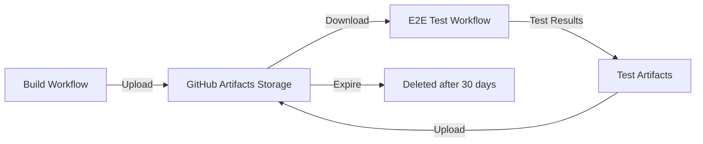

# E2E Workflow Integration Guide

**Last Updated:** 2025-10-22
**Version:** 1.0

This document explains how End-to-End (E2E) tests integrate with the CI/CD build workflows, including artifact passing, manual testing, and troubleshooting.

## Table of Contents

- [Overview](#overview)
- [Architecture](#architecture)
- [Workflow Call Pattern](#workflow-call-pattern)
- [Artifact Passing Mechanism](#artifact-passing-mechanism)
- [How to Trigger Manual Tests](#how-to-trigger-manual-tests)
- [Debugging Failed Tests](#debugging-failed-tests)
- [Troubleshooting Guide](#troubleshooting-guide)
- [Workflow Diagram](#workflow-diagram)
- [Best Practices](#best-practices)

---

## Overview

The Serena CI/CD pipeline integrates E2E tests with build workflows to ensure portable executables work correctly before release. The system uses GitHub Actions' `workflow_call` feature to create a modular, reusable testing pipeline.

### Key Components

1. **Build Workflows** - Create portable executables for Windows, Linux, macOS
2. **E2E Test Workflow** - Validates standalone builds work correctly
3. **Artifact Passing** - Transfers build outputs between workflows
4. **Test Reporting** - Generates detailed test summaries and reports

### Integration Points

```
Build Workflow → Upload Artifacts → E2E Test Workflow → Download Artifacts → Run Tests → Report Results
```

---

## Architecture

### Workflow Structure

The E2E testing system uses a two-tier architecture:

#### Tier 1: Build Workflows

- **windows-portable.yml** - Builds Windows standalone executables
- **linux-portable.yml** - Builds Linux standalone executables
- **macos-portable.yml** - Builds macOS standalone executables

These workflows:
1. Download language servers
2. Build PyInstaller executables
3. Create distribution bundles
4. Upload build artifacts
5. **Optionally call E2E test workflow**

#### Tier 2: E2E Test Workflow

- **test-e2e-portable.yml** - Tests standalone builds

This workflow:
1. Downloads build artifacts from calling workflow
2. Extracts and verifies build structure
3. Runs E2E test suite
4. Generates test reports
5. Comments results on PRs

### Test Layers

E2E tests are organized into 5 layers:

| Layer | Focus | Test File | Time |
|-------|-------|-----------|------|
| 1 | Standalone Executables | `test_standalone_executables.py` | <5s |
| 2 | MCP Communication | `test_mcp_server_communication.py` | <10s |
| 3 | Tool Execution | `test_tool_execution_e2e.py` | <30s |
| 4 | Language Server Integration | `test_language_server_e2e.py` | <60s |
| 5 | Project Workflows | `test_project_workflow_e2e.py` | <120s |

---

## Workflow Call Pattern

### What is `workflow_call`?

`workflow_call` is a GitHub Actions feature that allows one workflow to invoke another as a reusable component. This enables:

- **Modular design** - Separate concerns (build vs test)
- **Code reuse** - One test workflow for all platforms
- **Artifact sharing** - Pass build outputs between workflows
- **Conditional execution** - Only run tests when needed

### How It Works

#### In Build Workflow (Caller)

**Example from `windows-portable.yml`:**

```yaml
jobs:
  build-portable:
    # ... build steps ...
    steps:
      - name: Build portable executable
        # ... build code ...

      - name: Upload build artifacts
        uses: actions/upload-artifact@v4
        with:
          name: serena-windows-${{ matrix.arch }}-${{ matrix.bundle_tier }}
          path: dist/*.zip

  # Call E2E test workflow after build completes
  test-e2e:
    needs: build-portable
    uses: ./.github/workflows/test-e2e-portable.yml
    with:
      build_artifact_name: serena-windows-x64-essential
      tier: essential
      architecture: x64
```

#### In E2E Test Workflow (Callee)

**Example from `test-e2e-portable.yml`:**

```yaml
on:
  workflow_call:
    inputs:
      build_artifact_name:
        description: 'Name of build artifact to test'
        required: true
        type: string
      tier:
        description: 'Build tier'
        required: false
        default: 'essential'
        type: string
      architecture:
        description: 'Architecture'
        required: false
        default: 'x64'
        type: string

jobs:
  test-e2e-windows:
    runs-on: windows-2022
    steps:
      - name: Download build artifact
        if: inputs.build_artifact_name != ''
        uses: actions/download-artifact@v4
        with:
          name: ${{ inputs.build_artifact_name }}
          path: dist/
```

### Parameters Passed

| Parameter | Type | Required | Description |
|-----------|------|----------|-------------|
| `build_artifact_name` | string | Yes | Name of GitHub artifact containing build |
| `tier` | string | No | Bundle tier (minimal/essential/complete/full) |
| `architecture` | string | No | Architecture (x64/arm64) |

### Dual Trigger Support

The E2E test workflow supports both:

1. **Automatic trigger** (via `workflow_call`) - After successful build
2. **Manual trigger** (via `workflow_dispatch`) - For standalone testing

```yaml
on:
  workflow_dispatch:
    inputs:
      tier:
        description: 'Build tier to test'
        required: true
        default: 'essential'
        type: choice
        options:
          - minimal
          - essential
          - complete
          - full

  workflow_call:
    inputs:
      build_artifact_name:
        description: 'Name of build artifact to test'
        required: true
        type: string
```

---

## Artifact Passing Mechanism

### Overview

GitHub Actions artifacts enable workflows to share files. The build workflow creates artifacts, and the E2E test workflow consumes them.

### Artifact Structure

Build workflows create structured ZIP archives:

```
serena-windows-x64-essential-0.1.234.zip
├── serena-windows-x64-essential-0.1.234.exe    # Standalone executable
└── serena-windows-x64-essential-0.1.234-bundle.zip
    ├── bin/
    │   └── serena.exe
    ├── config/
    ├── docs/
    ├── examples/
    ├── VERSION.txt
    ├── README.md
    └── install.bat
```

### Upload Process

**In build workflow:**

```yaml
- name: Upload build artifacts
  if: inputs.upload_artifacts != false
  uses: actions/upload-artifact@v4
  with:
    name: serena-windows-${{ matrix.arch }}-${{ matrix.bundle_tier }}
    path: |
      dist/*.exe
      dist/*.zip
    retention-days: 30
    compression-level: 6
```

Key parameters:
- **name** - Unique identifier for the artifact
- **path** - Files/directories to include
- **retention-days** - How long GitHub stores the artifact
- **compression-level** - Balance speed vs size (0-9)

### Download Process

**In E2E test workflow:**

```yaml
- name: Download build artifact
  if: inputs.build_artifact_name != ''
  uses: actions/download-artifact@v4
  with:
    name: ${{ inputs.build_artifact_name }}
    path: dist/

- name: Extract build
  if: inputs.build_artifact_name != ''
  run: |
    Get-ChildItem dist\*.zip | ForEach-Object {
      Write-Host "Extracting $($_.Name)..."
      Expand-Archive -Path $_.FullName -DestinationPath dist\extracted\ -Force
    }
```

### Artifact Naming Convention

Artifacts follow this naming pattern:

```
serena-{platform}-{arch}-{tier}
```

Examples:
- `serena-windows-x64-essential`
- `serena-windows-arm64-complete`
- `serena-linux-x64-essential`
- `serena-macos-arm64-essential`

### Artifact Lifecycle



---

## How to Trigger Manual Tests

### Method 1: GitHub Actions UI

1. Navigate to the **Actions** tab in GitHub
2. Select **"E2E Tests for Portable Builds"** workflow
3. Click **"Run workflow"** button
4. Configure parameters:
   - **Branch** - Select branch to test
   - **Build tier** - Choose: minimal, essential, complete, or full
   - **Architecture** - Choose: x64 or arm64
5. Click **"Run workflow"**

### Method 2: GitHub CLI

```bash
# Install GitHub CLI if needed
# https://cli.github.com/

# Trigger E2E tests
gh workflow run test-e2e-portable.yml \
  -f tier=essential \
  -f architecture=x64

# Check status
gh run list --workflow=test-e2e-portable.yml

# View logs
gh run view --log
```

### Method 3: Via Build Workflow

E2E tests run automatically after successful builds:

```bash
# Trigger Windows build (E2E tests run automatically)
gh workflow run windows-portable.yml \
  -f bundle_tier=essential \
  -f architecture=x64

# Monitor progress
gh run watch
```

### Testing Pre-Built Artifacts

If you have a local build, you can test it directly:

```bash
# Windows PowerShell
$env:SERENA_BUILD_DIR = "C:\path\to\serena-portable-windows-x64-essential"
uv run pytest test/e2e/ -v -m e2e

# Linux/macOS
export SERENA_BUILD_DIR="/path/to/serena-portable-linux-x64-essential"
uv run pytest test/e2e/ -v -m e2e
```

### Running Specific Test Layers

```bash
# Layer 1: Standalone executables only
pytest test/e2e/ -v -m standalone

# Layer 2: MCP communication only
pytest test/e2e/ -v -m mcp

# Exclude slow tests (>30 seconds)
pytest test/e2e/ -v -m "e2e and not slow"

# Run with maximum verbosity
pytest test/e2e/ -vv -s -m e2e --tb=long
```

---

## Debugging Failed Tests

### Step 1: Check Workflow Logs

1. Go to **Actions** tab in GitHub
2. Click on the failed workflow run
3. Review the job summary for high-level status
4. Click on failed job to see detailed logs

### Step 2: Download Test Artifacts

Failed test runs upload diagnostic artifacts:

```yaml
- name: Upload test results
  if: always()
  uses: actions/upload-artifact@v4
  with:
    name: e2e-test-results-${{ inputs.tier }}-${{ inputs.architecture }}
    path: test-results/
    retention-days: 30
```

To download:

1. Scroll to bottom of workflow run page
2. Find **"Artifacts"** section
3. Click to download `e2e-test-results-{tier}-{arch}`
4. Extract and review:
   - `junit.xml` - Test results in JUnit format
   - `pytest.log` - Detailed pytest output

### Step 3: Reproduce Locally

Download the same build artifact that failed in CI:

```bash
# Download via GitHub CLI
gh run download {run-id} -n serena-windows-x64-essential

# Extract
unzip serena-windows-x64-essential-bundle.zip

# Set environment
export SERENA_BUILD_DIR="$(pwd)/serena-windows-x64-essential-bundle"

# Run same tests
pytest test/e2e/ -v -m e2e --tb=short --maxfail=3
```

### Step 4: Enable Debug Logging

Add debug flags to test command:

```bash
# Maximum verbosity
pytest test/e2e/ -vv -s --log-cli-level=DEBUG -m e2e

# Show full tracebacks
pytest test/e2e/ -v --tb=long -m e2e

# Stop on first failure
pytest test/e2e/ -v -x -m e2e
```

In GitHub Actions, modify the test step:

```yaml
- name: Run E2E tests
  run: |
    uv run pytest test/e2e/ -vv -s -m e2e --tb=long \
      --junitxml=test-results/junit.xml \
      -o log_cli=true \
      -o log_cli_level=DEBUG
```

### Step 5: Check Common Issues

#### Build Structure Issues

```bash
# Verify build structure
ls -R dist/extracted/serena-portable-*/

# Should have:
# - bin/serena.exe (or serena on Linux/Mac)
# - bin/serena-mcp-server.exe
# - bin/index-project.exe
# - config/
# - docs/
# - VERSION.txt
```

#### Executable Permissions (Linux/macOS)

```bash
# Check permissions
ls -la dist/extracted/serena-portable-*/bin/

# Fix if needed
chmod +x dist/extracted/serena-portable-*/bin/*
```

#### Missing Dependencies

```bash
# Check executable can run
./dist/extracted/serena-portable-*/bin/serena --version

# If fails, check dependencies
ldd ./dist/extracted/serena-portable-*/bin/serena  # Linux
otool -L ./dist/extracted/serena-portable-*/bin/serena  # macOS
```

#### MCP Server Connection Issues

```bash
# Test MCP server startup manually
./dist/extracted/serena-portable-*/bin/serena-mcp-server &

# Check if process started
ps aux | grep serena-mcp-server

# Check for errors
tail -f ~/.serena/logs/mcp-server.log
```

### Step 6: Analyze Test Results

Review JUnit XML for specific failure details:

```xml
<?xml version="1.0" encoding="utf-8"?>
<testsuites>
  <testsuite name="pytest" tests="15" failures="2" errors="0">
    <testcase classname="test_standalone_executables.TestStandaloneExecutables"
              name="test_serena_exe_version" time="0.234">
      <failure message="AssertionError: Version output is empty">
        assert len(output) > 0
        AssertionError: Version output is empty
      </failure>
    </testcase>
  </testsuite>
</testsuites>
```

### Step 7: Re-run with Fixes

After identifying the issue:

1. Fix the code
2. Rebuild locally to verify
3. Push changes
4. Re-trigger CI workflow

---

## Troubleshooting Guide

### Common Issues and Solutions

#### 1. "Build artifact not found"

**Symptom:**
```
Error: Unable to find any artifacts for the associated workflow
```

**Causes:**
- Artifact name mismatch
- Artifact expired (>30 days)
- Build workflow didn't complete successfully

**Solution:**
```yaml
# Check artifact name in build workflow
- name: Upload build artifacts
  with:
    name: serena-windows-x64-essential  # Must match exactly

# In E2E workflow
- name: Download build artifact
  with:
    name: serena-windows-x64-essential  # Must match exactly
```

#### 2. "Extraction failed - no files found"

**Symptom:**
```
ERROR: Executable not found at dist/extracted/serena-portable-*/bin/serena
```

**Causes:**
- ZIP structure doesn't match expected format
- Extraction path incorrect
- Bundle not created properly

**Solution:**
```powershell
# Debug extraction
Get-ChildItem dist\*.zip | ForEach-Object {
  Write-Host "Contents of $($_.Name):"
  & 'C:\Program Files\7-Zip\7z.exe' l $_.FullName
}

# Check extracted structure
Get-ChildItem -Recurse dist\extracted\
```

#### 3. "MCP server connection timeout"

**Symptom:**
```
TimeoutError: MCP server failed to start within 30 seconds
```

**Causes:**
- Server executable missing or corrupted
- Missing dependencies
- Server crashes on startup

**Solution:**
```bash
# Test server manually
./bin/serena-mcp-server --help

# Check for crash logs
cat ~/.serena/logs/mcp-server.log

# Run with debug output
SERENA_LOG_LEVEL=DEBUG ./bin/serena-mcp-server
```

#### 4. "Language server not found"

**Symptom:**
```
AssertionError: Language server 'pyright' not found in build
```

**Causes:**
- Testing wrong bundle tier
- Language server download failed during build
- Path configuration incorrect

**Solution:**
```bash
# Check what's actually bundled
ls -la language_servers/

# Essential tier includes:
# - pyright (Python)
# - typescript-language-server
# - rust-analyzer
# - gopls (Go)
# - jdtls (Java)

# Verify tier matches test expectations
echo $SERENA_BUNDLE_TIER  # Should match build tier
```

#### 5. "Test hangs indefinitely"

**Symptom:**
- Test runs for >5 minutes without completing
- No output or progress

**Causes:**
- Deadlock in MCP communication
- Language server hung
- Process didn't terminate

**Solution:**
```bash
# Add timeout to pytest
pytest test/e2e/ -v --timeout=60 -m e2e

# Kill hung processes
pkill -9 serena-mcp-server
pkill -9 pyright
```

#### 6. "Permission denied" (Linux/macOS)

**Symptom:**
```
PermissionError: [Errno 13] Permission denied: './bin/serena'
```

**Cause:**
- Executables not marked as executable

**Solution:**
```bash
# Fix permissions
chmod +x dist/extracted/serena-portable-*/bin/*

# Verify
ls -la dist/extracted/serena-portable-*/bin/
# Should show: -rwxr-xr-x
```

#### 7. "Import errors in tests"

**Symptom:**
```
ImportError: cannot import name 'MCPTestClient' from 'test.e2e.mcp_test_client'
```

**Cause:**
- Missing test dependencies

**Solution:**
```bash
# Install all test dependencies
uv pip install -e ".[dev]"
uv pip install pytest pytest-asyncio

# Verify installation
pytest --version
python -c "import pytest_asyncio; print('OK')"
```

#### 8. "Windows path too long errors"

**Symptom:**
```
OSError: [WinError 206] The filename or extension is too long
```

**Cause:**
- Windows MAX_PATH limitation (260 characters)

**Solution:**
```powershell
# Enable long paths in Windows 10+
# Run as Administrator:
New-ItemProperty -Path "HKLM:\SYSTEM\CurrentControlSet\Control\FileSystem" `
  -Name "LongPathsEnabled" -Value 1 -PropertyType DWORD -Force

# Or extract to shorter path
Expand-Archive -Path build.zip -DestinationPath C:\tmp\
```

---

## Workflow Diagram

### High-Level Flow

```
┌─────────────────────────────────────────────────────────────────────┐
│                         CI/CD Pipeline                              │
└─────────────────────────────────────────────────────────────────────┘

┌─────────────────┐     ┌─────────────────┐     ┌─────────────────┐
│  Push/PR Event  │────▶│  Build Trigger  │────▶│ Quality Checks  │
└─────────────────┘     └─────────────────┘     └─────────────────┘
                                                          │
                        ┌─────────────────────────────────▼───────┐
                        │    Parallel Build Matrix                │
                        │  ┌─────────┐ ┌─────────┐ ┌─────────┐   │
                        │  │ Windows │ │  Linux  │ │  macOS  │   │
                        │  └────┬────┘ └────┬────┘ └────┬────┘   │
                        └───────┼───────────┼──────────┼─────────┘
                                │           │          │
                        ┌───────▼───────────▼──────────▼─────────┐
                        │     Download Language Servers           │
                        └───────┬───────────┬──────────┬─────────┘
                                │           │          │
                        ┌───────▼───────────▼──────────▼─────────┐
                        │       Build PyInstaller Bundle          │
                        └───────┬───────────┬──────────┬─────────┘
                                │           │          │
                        ┌───────▼───────────▼──────────▼─────────┐
                        │        Upload Build Artifacts           │
                        └───────┬───────────┬──────────┬─────────┘
                                │           │          │
┌───────────────────────────────▼───────────▼──────────▼─────────────┐
│                         E2E Test Workflow                           │
├─────────────────────────────────────────────────────────────────────┤
│  ┌──────────────────────────────────────────────────────────────┐  │
│  │ 1. Download Artifacts                                        │  │
│  └──────────────┬───────────────────────────────────────────────┘  │
│  ┌──────────────▼───────────────────────────────────────────────┐  │
│  │ 2. Extract & Verify Build Structure                          │  │
│  └──────────────┬───────────────────────────────────────────────┘  │
│  ┌──────────────▼───────────────────────────────────────────────┐  │
│  │ 3. Run E2E Test Suite                                        │  │
│  │    - Layer 1: Standalone Executables                         │  │
│  │    - Layer 2: MCP Communication                              │  │
│  │    - Layer 3: Tool Execution                                 │  │
│  │    - Layer 4: Language Server Integration                    │  │
│  │    - Layer 5: Project Workflows                              │  │
│  └──────────────┬───────────────────────────────────────────────┘  │
│  ┌──────────────▼───────────────────────────────────────────────┐  │
│  │ 4. Generate Test Reports                                     │  │
│  └──────────────┬───────────────────────────────────────────────┘  │
│  ┌──────────────▼───────────────────────────────────────────────┐  │
│  │ 5. Upload Test Results                                       │  │
│  └──────────────┬───────────────────────────────────────────────┘  │
│  ┌──────────────▼───────────────────────────────────────────────┐  │
│  │ 6. Comment on PR (if applicable)                             │  │
│  └──────────────────────────────────────────────────────────────┘  │
└─────────────────────────────────────────────────────────────────────┘
                                │
                        ┌───────▼────────┐
                        │ Tests Pass/Fail│
                        └────────────────┘
```

### Detailed Test Execution Flow

```
┌─────────────────────────────────────────────────────────────────────┐
│                    E2E Test Execution Detail                        │
└─────────────────────────────────────────────────────────────────────┘

Start
  │
  ▼
┌─────────────────────────────────┐
│ Setup: Download Build Artifact  │
└─────────────┬───────────────────┘
              │
              ▼
┌─────────────────────────────────┐
│ Extract ZIP to dist/extracted/  │
└─────────────┬───────────────────┘
              │
              ▼
┌─────────────────────────────────┐
│ Verify Build Structure          │
│ - bin/ directory exists         │
│ - config/ directory exists      │
│ - docs/ directory exists        │
│ - VERSION.txt exists            │
│ - All executables present       │
└─────────────┬───────────────────┘
              │
              ▼
┌─────────────────────────────────┐
│ Set SERENA_BUILD_DIR env var    │
└─────────────┬───────────────────┘
              │
              ▼
┌─────────────────────────────────────────────────────────┐
│ Layer 1: Test Standalone Executables (5 tests, <5s)    │
│ ✓ serena --version                                      │
│ ✓ serena --help                                         │
│ ✓ serena-mcp-server --help                              │
│ ✓ index-project --help                                  │
│ ✓ Executable file structure                             │
└─────────────┬───────────────────────────────────────────┘
              │
              ▼
┌─────────────────────────────────────────────────────────┐
│ Layer 2: Test MCP Communication (8 tests, <10s)        │
│ ✓ Start MCP server                                      │
│ ✓ List available tools                                  │
│ ✓ Get tool schema                                       │
│ ✓ Basic tool invocation                                 │
│ ✓ Error handling                                        │
│ ✓ Concurrent requests                                   │
└─────────────┬───────────────────────────────────────────┘
              │
              ▼
┌─────────────────────────────────────────────────────────┐
│ Layer 3: Test Tool Execution (15 tests, <30s)          │
│ ✓ File operations (read, write, search)                 │
│ ✓ Symbol operations (find, edit)                        │
│ ✓ Project operations (init, index)                      │
│ ✓ Memory operations (store, retrieve)                   │
└─────────────┬───────────────────────────────────────────┘
              │
              ▼
┌─────────────────────────────────────────────────────────┐
│ Layer 4: Test Language Server Integration (20 tests)   │
│ ✓ LS startup/shutdown                                   │
│ ✓ Symbol resolution                                     │
│ ✓ Code completion                                       │
│ ✓ Crash recovery                                        │
│ ✓ Multi-language support                                │
└─────────────┬───────────────────────────────────────────┘
              │
              ▼
┌─────────────────────────────────────────────────────────┐
│ Layer 5: Test Project Workflows (10 tests, <120s)      │
│ ✓ Project initialization                                │
│ ✓ Full indexing workflow                                │
│ ✓ Memory persistence                                    │
│ ✓ Multi-step workflows                                  │
└─────────────┬───────────────────────────────────────────┘
              │
              ▼
┌─────────────────────────────────┐
│ Generate Test Summary           │
│ - Total tests run               │
│ - Pass/fail counts              │
│ - Duration                      │
│ - Coverage by layer             │
└─────────────┬───────────────────┘
              │
              ▼
┌─────────────────────────────────┐
│ Upload Test Artifacts           │
│ - junit.xml                     │
│ - pytest.log                    │
│ - Coverage report               │
└─────────────┬───────────────────┘
              │
              ▼
┌─────────────────────────────────┐
│ Post Results to PR (if PR)      │
└─────────────┬───────────────────┘
              │
              ▼
            End
```

### Artifact Flow Diagram

```
┌────────────────────────────────────────────────────────────────┐
│                    Artifact Lifecycle                          │
└────────────────────────────────────────────────────────────────┘

Build Workflow                         E2E Test Workflow
─────────────                          ─────────────────

┌───────────────┐
│ PyInstaller   │
│ Build Process │
└───────┬───────┘
        │
        │ Creates
        ▼
┌───────────────────────────────┐
│ dist/                         │
│ ├── serena-*.exe              │
│ └── serena-*-bundle.zip       │
└───────┬───────────────────────┘
        │
        │ Upload
        ▼
┌───────────────────────────────┐
│ GitHub Artifacts Storage      │
│ Name: serena-windows-x64-...  │
│ Retention: 30 days            │
└───────┬───────────────────────┘
        │                              ┌──────────────────┐
        │ Download                     │ Test Runner      │
        └─────────────────────────────▶│ (pytest)         │
                                       └────────┬─────────┘
                                                │
                                       ┌────────▼─────────┐
                                       │ Extract to       │
                                       │ dist/extracted/  │
                                       └────────┬─────────┘
                                                │
                                       ┌────────▼─────────┐
                                       │ Run Test Suite   │
                                       └────────┬─────────┘
                                                │
                                       ┌────────▼─────────┐
                                       │ Generate         │
                                       │ test-results/    │
                                       │ ├── junit.xml    │
                                       │ └── pytest.log   │
                                       └────────┬─────────┘
                                                │
                                                │ Upload
                                                ▼
                                       ┌──────────────────┐
                                       │ Test Results     │
                                       │ Artifact         │
                                       └──────────────────┘
```

---

## Best Practices

### For Build Workflows

1. **Always upload artifacts conditionally**
   ```yaml
   - name: Upload build artifacts
     if: inputs.upload_artifacts != false
   ```

2. **Use consistent naming**
   ```yaml
   name: serena-${{ runner.os }}-${{ matrix.arch }}-${{ matrix.tier }}
   ```

3. **Include version in artifact**
   ```yaml
   path: |
     dist/serena-*-${VERSION}.exe
     dist/serena-*-${VERSION}-bundle.zip
   ```

4. **Set appropriate retention**
   ```yaml
   retention-days: 30  # Balance storage costs vs availability
   ```

5. **Optimize compression**
   ```yaml
   compression-level: 6  # Good balance of speed and size
   ```

### For E2E Tests

1. **Fail fast on critical errors**
   ```bash
   pytest test/e2e/ --maxfail=3  # Stop after 3 failures
   ```

2. **Use appropriate timeouts**
   ```python
   @pytest.mark.timeout(30)  # Per-test timeout
   ```

3. **Clean up resources**
   ```python
   try:
       proc = standalone_env.start_mcp_server()
       # ... test code ...
   finally:
       if proc.poll() is None:
           proc.terminate()
   ```

4. **Mark slow tests**
   ```python
   @pytest.mark.slow
   def test_full_indexing(...):
       ...
   ```

5. **Generate comprehensive reports**
   ```yaml
   --junitxml=test-results/junit.xml
   --html=test-results/report.html
   ```

### For Debugging

1. **Enable verbose output in CI**
   ```yaml
   run: pytest -vv -s --tb=long
   ```

2. **Always upload test results**
   ```yaml
   - name: Upload test results
     if: always()  # Even on failure
   ```

3. **Include diagnostic information**
   ```yaml
   - name: Debug info
     if: failure()
     run: |
       ls -R dist/
       env | grep SERENA
   ```

4. **Use structured logging**
   ```yaml
   -o log_cli=true
   -o log_cli_level=INFO
   ```

5. **Comment results on PRs**
   ```yaml
   - name: Comment on PR
     if: github.event_name == 'pull_request' && always()
     uses: actions/github-script@v7
   ```

---

## Additional Resources

### Documentation

- **E2E Testing Guide** - `/docs/E2E_TESTING.md`
- **Test Framework Design** - `/docs/E2E_TEST_FRAMEWORK_DESIGN.md`
- **GitHub Actions Status** - `/docs/GITHUB_ACTIONS_STATUS_REPORT.md`

### Workflow Files

- **Windows Build** - `.github/workflows/windows-portable.yml`
- **Linux Build** - `.github/workflows/linux-portable.yml`
- **macOS Build** - `.github/workflows/macos-portable.yml`
- **E2E Tests** - `.github/workflows/test-e2e-portable.yml`

### Test Files

- **Standalone Tests** - `test/e2e/test_standalone_executables.py`
- **MCP Tests** - `test/e2e/test_mcp_server_communication.py`
- **Test Utilities** - `test/e2e/standalone_utils.py`
- **Test Client** - `test/e2e/mcp_test_client.py`

### GitHub Actions Documentation

- [Workflow Syntax](https://docs.github.com/en/actions/using-workflows/workflow-syntax-for-github-actions)
- [Reusing Workflows](https://docs.github.com/en/actions/using-workflows/reusing-workflows)
- [Artifacts](https://docs.github.com/en/actions/using-workflows/storing-workflow-data-as-artifacts)
- [Context Variables](https://docs.github.com/en/actions/learn-github-actions/contexts)

---

## Changelog

### Version 1.0 (2025-10-22)

- Initial documentation
- Complete workflow call pattern documentation
- Artifact passing mechanism details
- Manual testing instructions
- Debugging guide
- Troubleshooting section
- Workflow diagrams

---

**Maintained by:** Serena Team
**Questions?** File an issue at https://github.com/resline/serena/issues
